# Custom AWS AMI & Terraform Infrastructure

## 📌 Overview

This project does two things:
1. **Packer** creates a custom Amazon Linux AMI with Docker installed and your SSH public key added.
2. **Terraform** provisions AWS infrastructure:
   - A new VPC with public and private subnets (using a module)
   - A bastion host in the public subnet (accessible only from your IP)
   - 6 EC2 instances in the private subnets running the custom AMI

---


## 📌 Repository Structure
<pre> ``` 
    my-aws-iac-project/
    ├── packer/
    │   └── amazon-linux-docker.pkr.hcl
    ├── terraform/
    │   ├── main.tf
    │   ├── variables.tf
    │   └── outputs.tf
    └── README.md
``` </pre>
---


## How to Run

### 🔹 Step 0: Install Packer if needed
```sh
    brew tap hashicorp/tap
    brew install hashicorp/tap/packer
    packer -v
```

---


### 🔹 Step 1: Build the Custom AMI with Packer
1. **Navigate to the `packer/` directory**:
```bash
    cd packer
```
2. **Initialize, validate, and build the AMI**
```sh
    packer init .
    packer validate .
    packer build amazon-linux-docker.pkr.hcl
```
You show see below screenshots with Packer
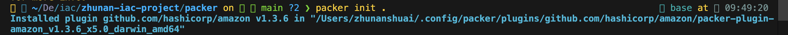
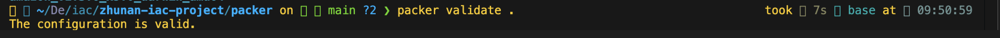
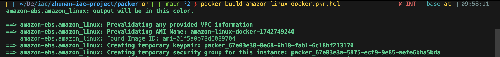
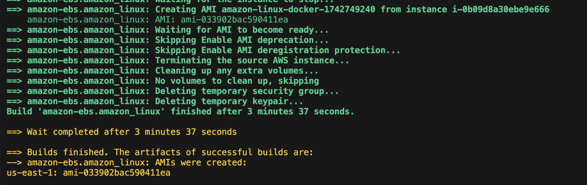

**Output will be customerized AMI ID**
```sh
    ==> amazon-ebs.amazon_linux: Creating AMI amazon-linux-docker-1742749240 from instance i-0b09d8a30ebe9e666
    ==> amazon-ebs.amazon_linux: AMI: ami-033902bac590411ea
    ==> Builds finished. The artifacts of successful builds are:
    --> amazon-ebs.amazon_linux: AMIs were created:
    us-east-1: ami-033902bac590411ea
```
**Copy this AMI ID for use in later Terraform deployment.**

---

### 🔹 Step 3: Build the Terraform

0. **Navigate to the terraform/ directory**
```bash
    cd ../terraform
```

1. **Build Terraform if needed**
```sh
    brew tap hashicorp/tap
    brew install hashicorp/tap/terraform
    terraform -v
```
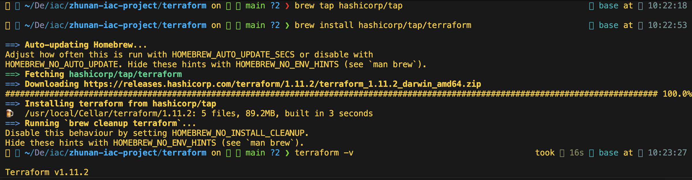

2. **Initialize and apply Terraform:**
```sh
    terraform init
    terraform plan
    terraform apply
```

You show see below screenshots with Terraform apply
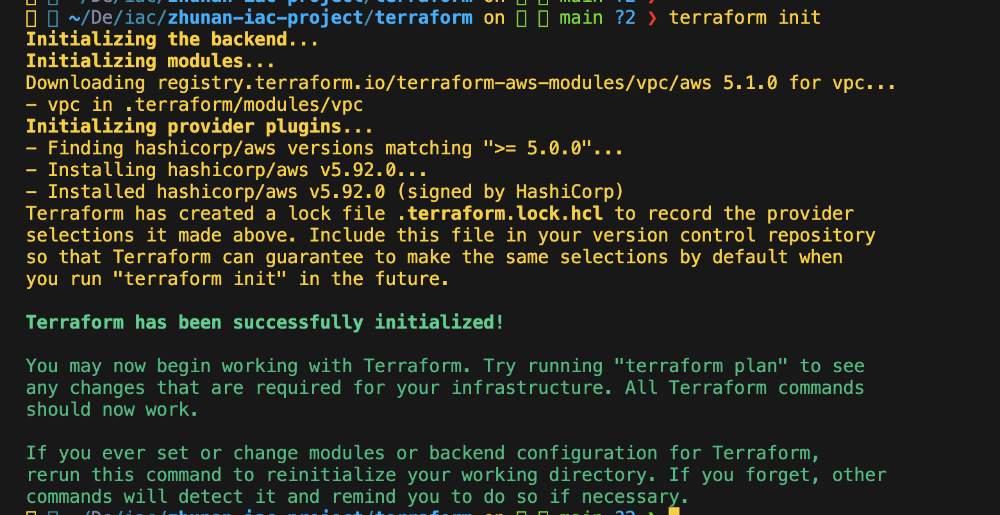
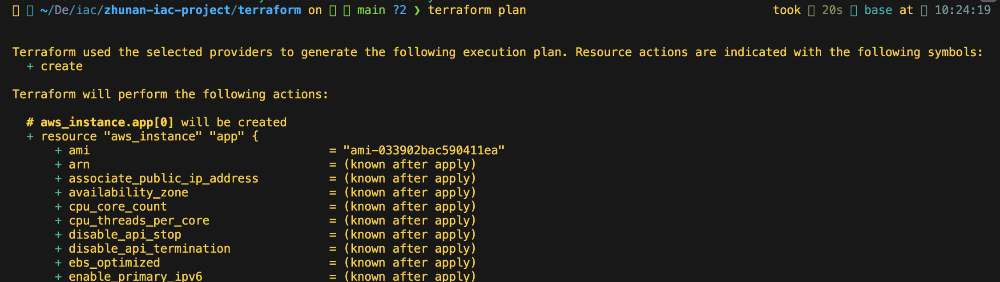
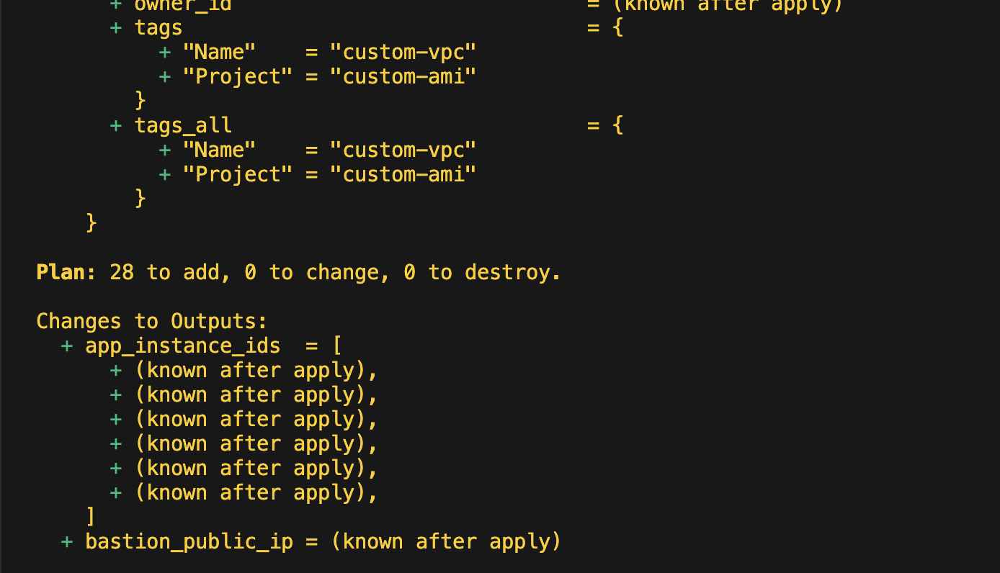
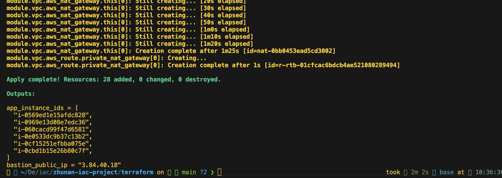

```sh
    Outputs:

    app_instance_ids = [
    "i-0569ed1e15afdc828",
    "i-0969e13d08e7edc36",
    "i-060cacd99f47d6581",
    "i-0e0533dc9b37c13b2",
    "i-0cf15251efbba075e",
    "i-0cbd1b15e26b80c7f",
    ]

    bastion_public_ip = "3.84.40.18"
```

**Note the outputs**
1. Bastion Public IP for SSH access.
2. Private EC2 Instance IDs

---

### 🔹 Step 3: SSH into bastion host && access to all 6 EC2 from bastion host
```sh
    ssh -A -i ~/Desktop/zhunan-new.pem ec2-user@3.84.40.18
```
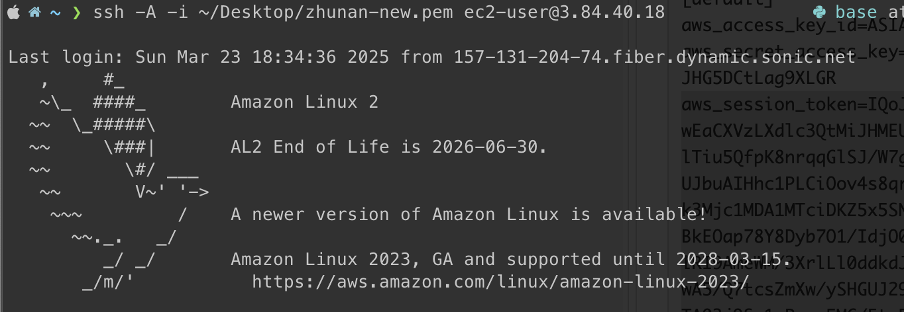

**list all 7 instances and ssh into all 6 instances**
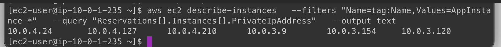
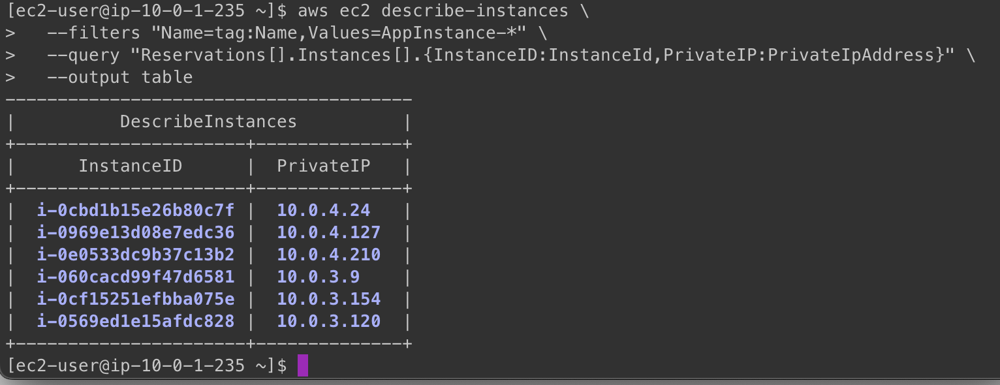

**SSH into instance examples from baston host**
```sh
    ssh ec2-user@10.0.3.120
```
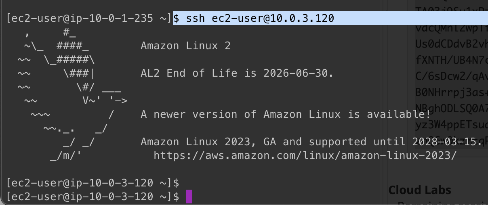


### 🔹 Step 4: Evidences for VPC, subnets, public subnets, all necessary routes, bastion host in the public subnet, 6 EC2 instances in the private subnet

0. **Shows bastion host EC2 and all 6 private EC2**
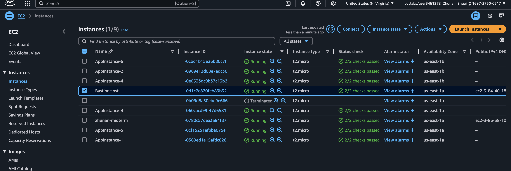


1. **All 6 private instance are in the private subnet with no public IP, only private IP**
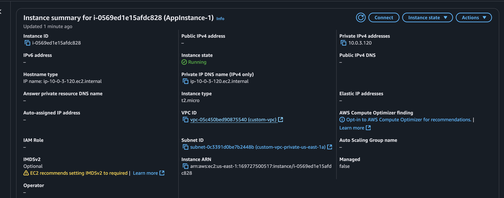

2. **Bastion host accept only your IP on port 22**
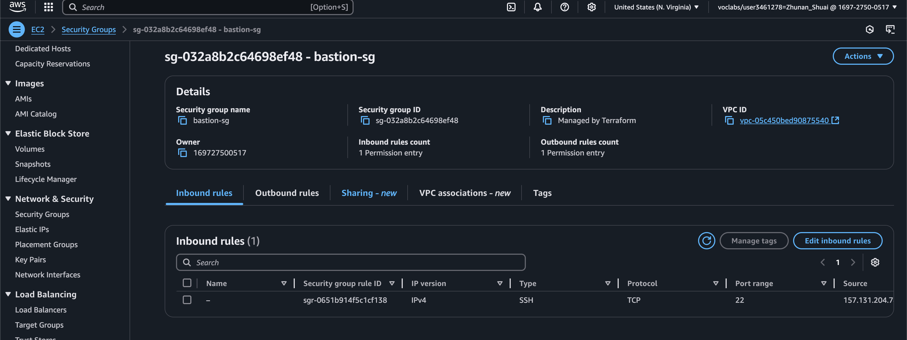
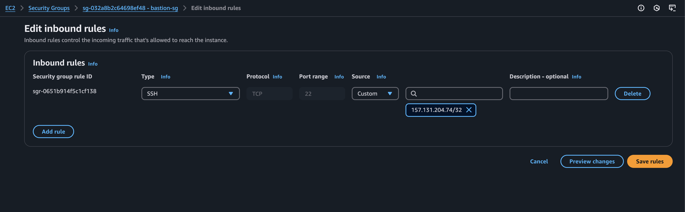

3. **Bastion host instance in public subnet and have public IP**
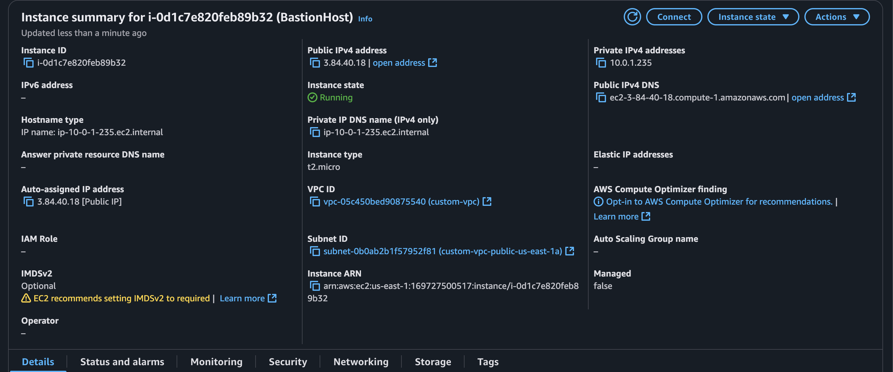

4. **Show routes table && security group**
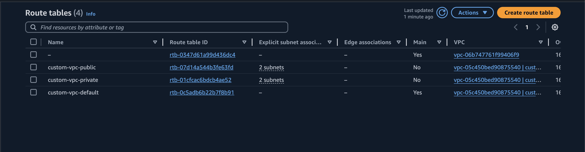
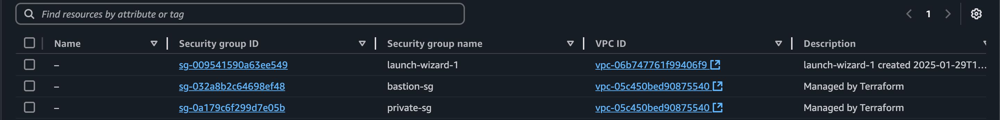

5. **Show VPC private and public subnets**
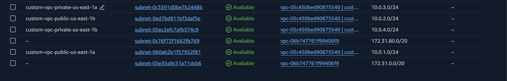


