# Custom AWS AMI & Terraform Infrastructure

## 📌 Overview

This project automates infrastructure and configuration using **Packer**, **Terraform**, and **Ansible**.

### 🔨 Packer
Builds a **custom Amazon Linux AMI** with:
- Docker pre-installed
- SSH public key added

### 🌐 Terraform
Provisions AWS infrastructure:
- A VPC with public and private subnets (via module)
- A **bastion host** in the public subnet (for SSH access)
- **6 EC2 instances** in private subnets:
  - 3 x Ubuntu (tagged `OS=ubuntu`)
  - 3 x Amazon Linux (tagged `OS=amazon`)
- **1 EC2 Ansible controller** (Ubuntu) inside a private subnet

### ⚙️ Ansible
From the controller, we use Ansible with **dynamic inventory** to:
- Connect to the 6 private EC2s
- Run a playbook that:
  - Updates & upgrades packages (`apt` for Ubuntu, `yum` for Amazon Linux)
  - Installs Docker (if not already installed)
  - Prints the Docker version
  - Reports disk usage (`df -h /`)

---


## 📌 Repository Structure
<pre> ``` 
    my-aws-iac-project/
├── ansible/
│   ├── ansible.cfg
│   ├── aws_ec2.yaml
│   ├── playbook.yml
│   └── group_vars/
│       ├── os_amazon/
│       │   └── main.yml     
│       └── os_ubuntu/
│           └── main.yml     
├── packer/
│   └── amazon-linux-docker.pkr.hcl
├── terraform/
│   ├── main.tf
│   ├── variables.tf
│   └── outputs.tf
└── README.md
``` </pre>
---


## How to Run

### 🔹 Step 0: Install Packer if needed
```sh
    brew tap hashicorp/tap
    brew install hashicorp/tap/packer
    packer -v
```

---

# 🔹 Step 1: Build the Terraform

1. **Navigate to the terraform/ directory**
```bash
    cd terraform
```

2. **Initialize and apply Terraform:**
```sh
    terraform init
    terraform plan
    terraform apply
```

You show see below screenshots with Terraform apply
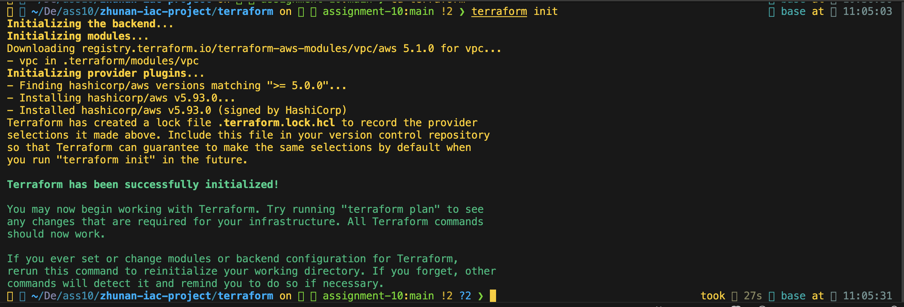
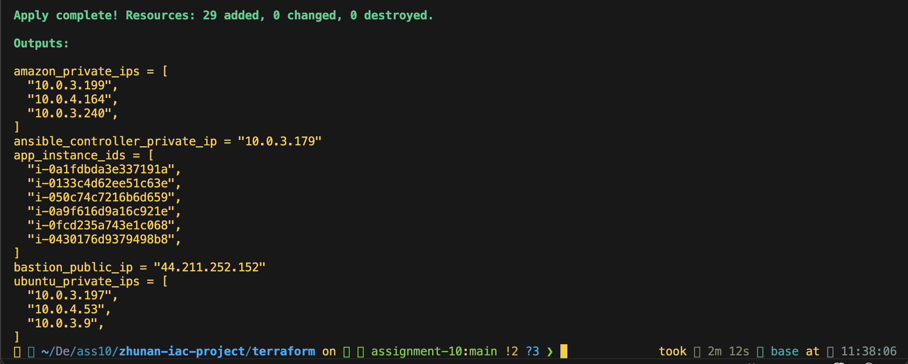

```sh
    Outputs:

    amazon_private_ips = [
        "10.0.3.199",
        "10.0.4.164",
        "10.0.3.240",
    ]

    ansible_controller_private_ip = "10.0.3.179"

    app_instance_ids = [
        "i-0a1fbdba3e337191a",
        "i-0133c4d62ee51c63e",
        "i-050c74c7216b6d659",
        "i-0a9f616d9a16c921e",
        "i-0fcd235a743e1c068",
        "i-0430176d9379498b8",
    ]

    bastion_public_ip = "44.211.252.152"

    ubuntu_private_ips = [
        "10.0.3.197",
        "10.0.4.53",
        "10.0.3.9",
    ]
```

**Note the outputs**
1. 3 amazon linux private IP
2. 3 ubuntu private IP
3. 1 bastion host public IP
4. 1 ansible controller pirvate IP
5. Private EC2 Instance IDs

You will provision a total of **7 EC2 instances** from Terraform:

| Instance Type               | Count | Notes                                      |
|----------------------------|-------|--------------------------------------------|
| Ubuntu EC2                 | 3     | Tag: `OS = ubuntu`                         |
| Amazon Linux EC2           | 3     | Tag: `OS = amazon`                         |
| Ansible Controller (Ubuntu)| 1     | No OS tag needed, tag as `Name = AnsibleController` |

---

- All 7 go in **private subnets** 🔒  
- Only the **bastion host** lives in the **public subnet** with a public IP for SSH jump access.


You should able to see all instances are running in AWS console
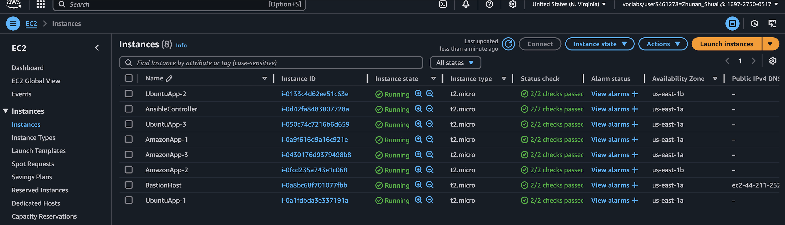

---

### 🔹 Step 2: SSH into bastion host && access to ansible controller
```sh
    ssh -A -i ~/Desktop/zhunan-new.pem ec2-user@44.211.252.152
```
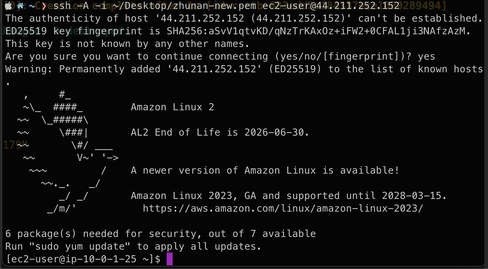

**SSH into ansible controller from baston host**
```sh
    ssh ubuntu@10.0.3.179
```
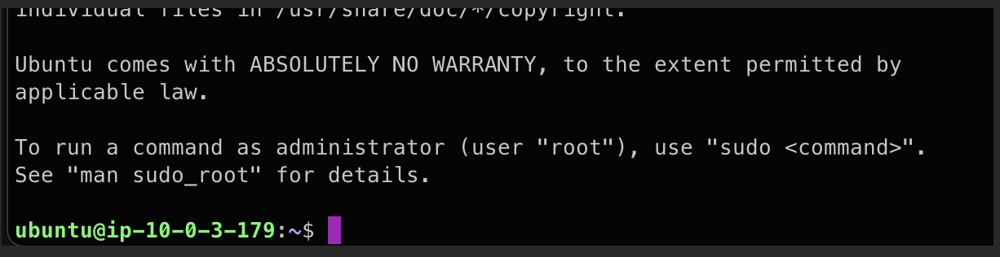

---

### 🔹 Step 3: Install Ansible Controller

**Navigate to the ansible/ directory**
```bash
    cd ansible
```

```sh
    sudo apt update
    sudo apt install -y software-properties-common
    sudo add-apt-repository --yes --update ppa:ansible/ansible
    sudo apt install -y ansible python3-boto3
```

---


### 🔹 Step 4: Create Dynamic Inventory aws_ec2.yaml
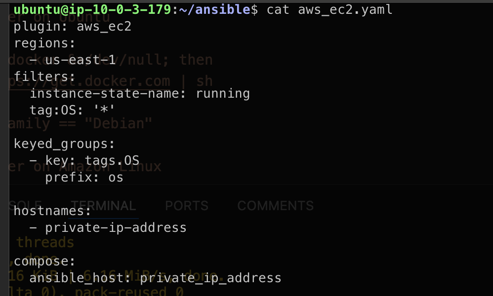

**Test Inventory: visualize the structure of dynamic inventory**
```sh
    ansible-inventory -i aws_ec2.yaml --graph
```
outputs:
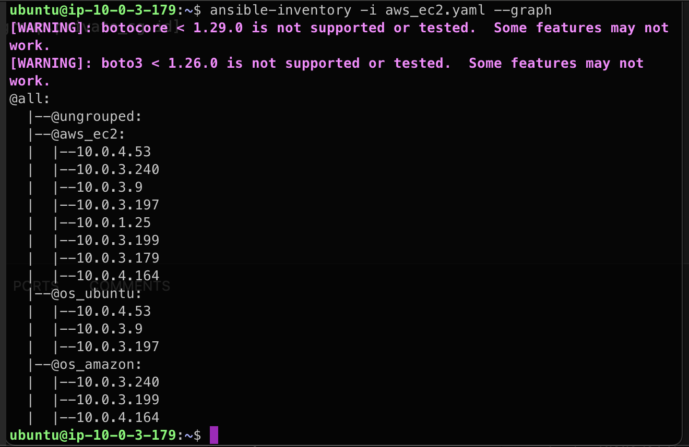

---

### 🔹 Step 5: Create Playbook
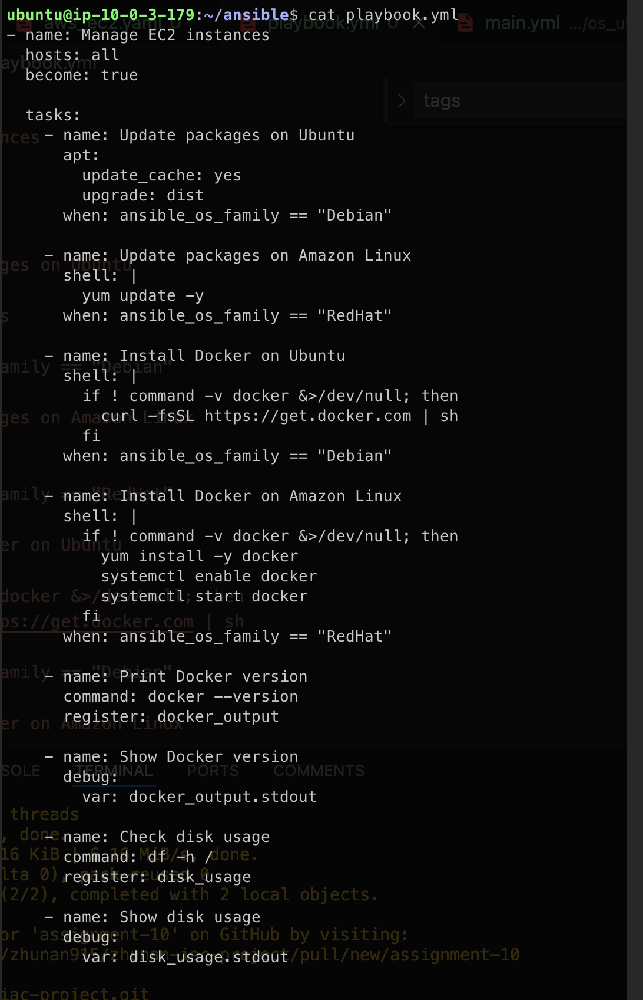


**Import key pem from local to ansible controller, Use scp with a Bastion Jump Host, Since your Ansible controller is in a private subnet, you must proxy through your Bastion host.**
```bash
scp -i ~/Desktop/zhunan-new.pem -o "ProxyJump ec2-user@44.211.252.152" ~/Desktop/zhunan-new.pem ubuntu@10.0.3.179:~/
```
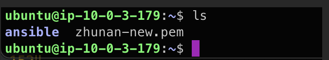


```sh
    ansible-playbook -i aws_ec2.yaml playbook.yml
```
or
```sh
    ansible-playbook playbook.yml
```

This command runs Ansible playbook (playbook.yml) using a dynamic inventory file (aws_ec2.yaml) to discover and target EC2 instances.

-i aws_ec2.yaml: Uses the EC2 plugin to find your instances dynamically by tags/filters.

playbook.yml: This file includes your tasks:
✅ Update & upgrade packages
✅ Check Docker version (and install if missing)
✅ Report disk usage

You should see below outputs
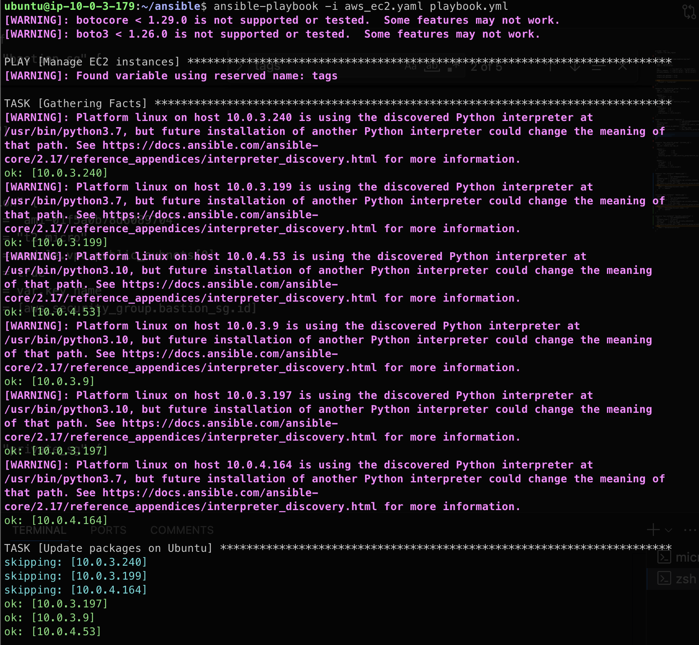
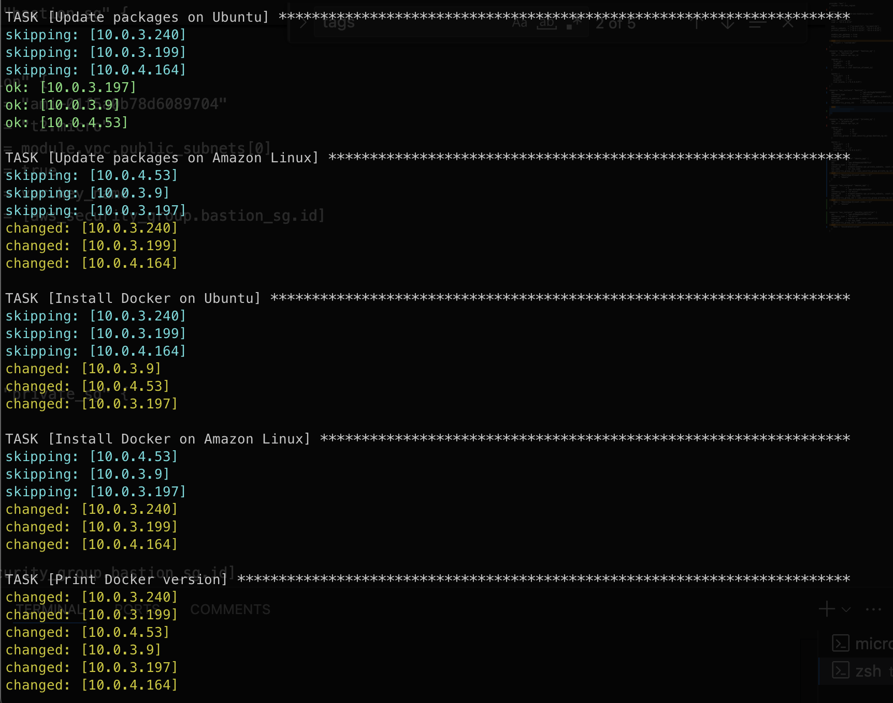
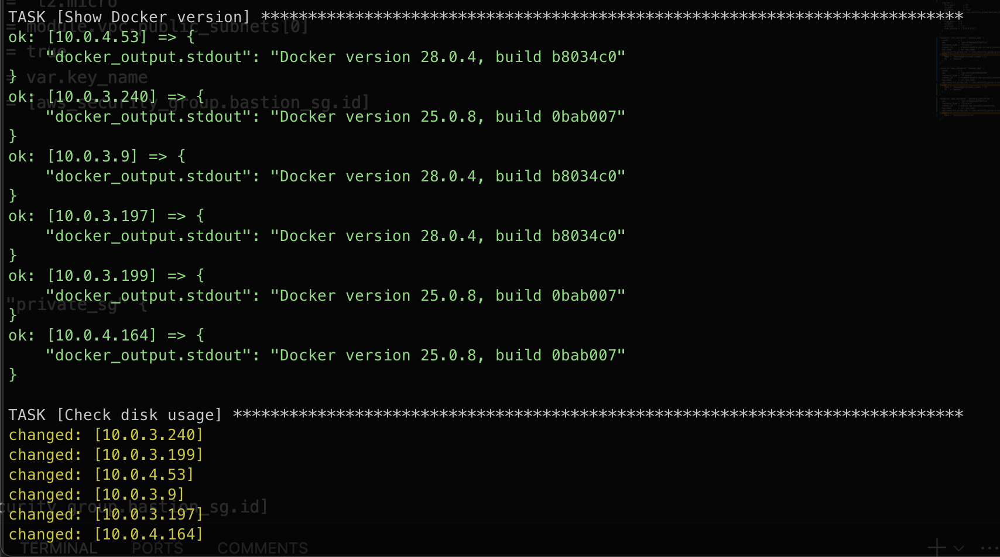
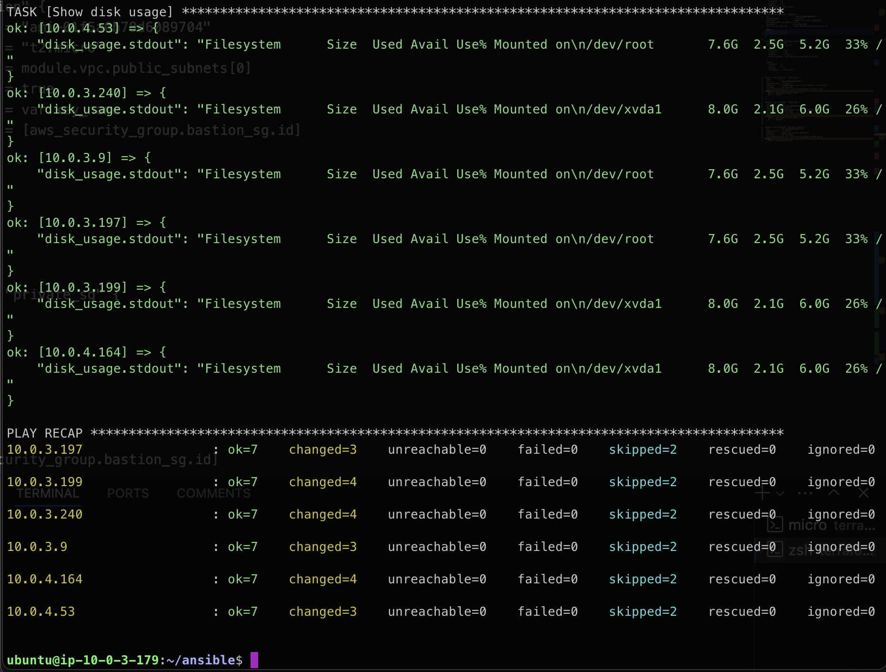